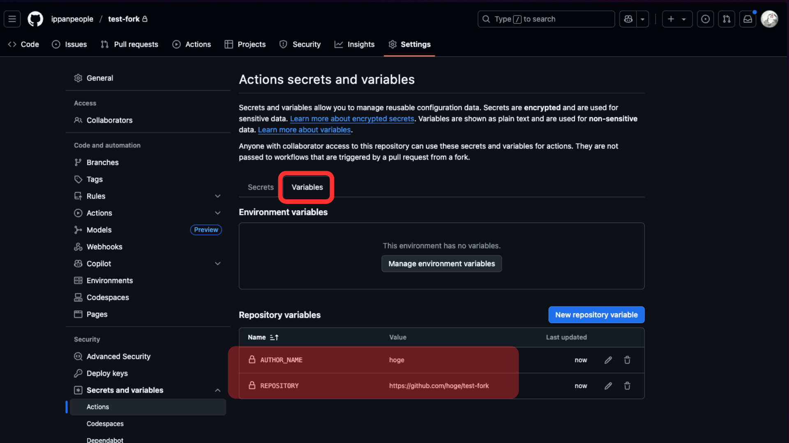

# 01 GitHub Actions のフォークとセットアップ
このステップでは、リポジトリのフォークと GitHub Actions のセットアップ方法を解説し、Go アプリケーションをさくらの AppRun サービスにデプロイするための準備を行います。

> [!IMPORTANT]
> **目的**: GitHub Actions でワークフローを実行するための設定方法を理解する

> [!IMPORTANT]
> **ゴール**: GitHub Actions のパーミッション、シークレット、変数の設定と、トリガーによるワークフロー実行の確認

## GitHub Actions の有効化方法
1. **ワークフローが無効化されている状態を確認**
   - フォーク直後や新規リポジトリでは、GitHub Actions ワークフローが無効化されている場合があります。

2. **なぜワークフローが無効化されているのか確認**
    - GitHub Actions は、リポジトリの設定でワークフローのパーミッションが適切に設定されていない場合に無効化されます。
    - GitHub Actions は、.github/workflow ディレクトリ内にワークフロー定義ファイルが存在しない場合、またはワークフローのパーミッションが適切に設定されていない場合に無効化されます。

3. **ワークフローを有効化する方法**
    - Settings > Actions > General に移動し Actions permissions を「Allow all actions and reusable workflows」に設定します。
    - 既存の .github/workflows-disable を正しくリネームして .github/workflows にします。


4. **有効化後の状態を確認**
   - 有効化が完了すると、ワークフローが実行可能な状態になります。


## GitHub Actions のシークレットと変数の設定方法
GitHub Actions では、外部サービスへの認証情報や個人情報などを安全に管理するために「シークレット（Secrets）」と「変数（Variables）」を利用します。シークレットは主にパスワードや API キーなどの機密情報を、変数はワークフロー内で再利用したい値（例：自分の名前やリポジトリリンクなど）を格納します。これらはリポジトリの Settings > Secrets and variables から設定できます。

1. **シークレットの設定**: Slack の Incoming Webhook URL など、外部サービス連携に必要な情報を登録します。
   - 例: Slack の Incoming Webhook URL
   ````
   SLACK_WEBHOOK_URL
   ````


2. **変数の設定**: ワークフロー内で使う名前やリポジトリリンクなどを登録します。
   - 例: 自分の名前
   ````
   AUTHOR_NAME
   ````
   - 例: 自分の GitHub リポジトリリンク
   ````
   REPOSITORY
   ````


3. **設定後の確認**: 設定が正しく反映されているか確認します。



## GitHub Actions ワークフローの実行方法
1. **ワークフローの選択**: リポジトリの Actions タブに移動し、対象のワークフローを選択します。
2. **ワークフローの実行**: 「Run workflow」ボタンをクリックします。

3. **実行の確認**: ワークフローが正常に実行されると、Slack チャンネルにメッセージが送信されます。これにより、GitHub Actions のセットアップが正しく行われたことを確認できます。

> [!WARNING]
> 注意: ワークフローの実行には、`Run workflow` ボタンを連打しないように

## To Do リスト
- [ ] (リポジトリをフォークする)[https://github.com/ippanpeople/test]
- [ ] GitHub Actions をセットアップする
    - [ ] ワークフローのパーミッションを「Allow all actions and reusable workflows」に設定
    - [ ] Actions Secret `SLACK_WEBHOOK_URL` を作成し、Slack の Incoming Webhook URL を登録
    - [ ] Actions Variable `AUTHOR_NAME` を作成し、自分の名前を登録
    - [ ] Actions Variable `REPOSITORY` を作成し、自分の GitHub リポジトリリンクを登録
- [ ] ワークフローを設定し、Slack へメッセージを送信できるようにする
    - [ ] ワークフロー内の "text" を自分のメッセージに更新
    - [ ] 変更をリポジトリにプッシュ
- [ ] ワークフローが Slack へメッセージを送信できるかテスト
    - [ ] リポジトリの Actions タブに移動
    - [ ] 対象ワークフローを選択し「Run workflow」をクリック
    - [ ] Slack チャンネルにメッセージが表示されることを確認


