<!-- _class: pink lead -->

# 2025年　夏季インターンシップ
## GitHub Actions 説明用資料

さくらインターネット テクノロジーオフィス　リンウェイトン

---

## 目次

- GitHub Actions 入門
- GitHub Actions の初期設定
- Composite Actions の運用
- sacloud_apprun_actions を使った AppRun デプロイ

---

<!-- _class: pink lead -->

# GitHub Actions 入門

---

## GitHub Actions とは？

- バージョン管理システムであるGitHub上に提供する、ワークフローを自動化するCI/CDツール
- **できごと**
  - イベント駆動型で、変更されたコードに応じて自動的にビルド・テスト・デプロイを実行
- **基盤**
  - GitHub上やセルフホストされたランナーでワークフローの定義に基づき動作
- **ユーザビリティ**
  - GitHubのUI上で簡単に設定・管理が可能、CLIやAPIからも操作可能

---

## GitHub Actions の基本コンポーネント

- **Actions**
  - 自動化ツールのこと。GitHub Actionsの基本単位で、特定のタスクを実行するためのコード
- **Workflow**
  - `.github/workflows/*.yml` で定義される自動化プロセス。トリガー、ジョブ、ステップを含む
- **Trigger**
  - ワークフローを開始するイベント（例: `push`、`pull_request`、手動実行など）
- **Jobs**
  - 同じランナー環境（仮想マシンなど）で実行されるステップの集合。並列または順次実行が可能

---

## GitHub Actions の基本コンポーネント

- **Steps**
  - ジョブ内の個々のタスク。コマンド実行やアクションの呼び出しができる
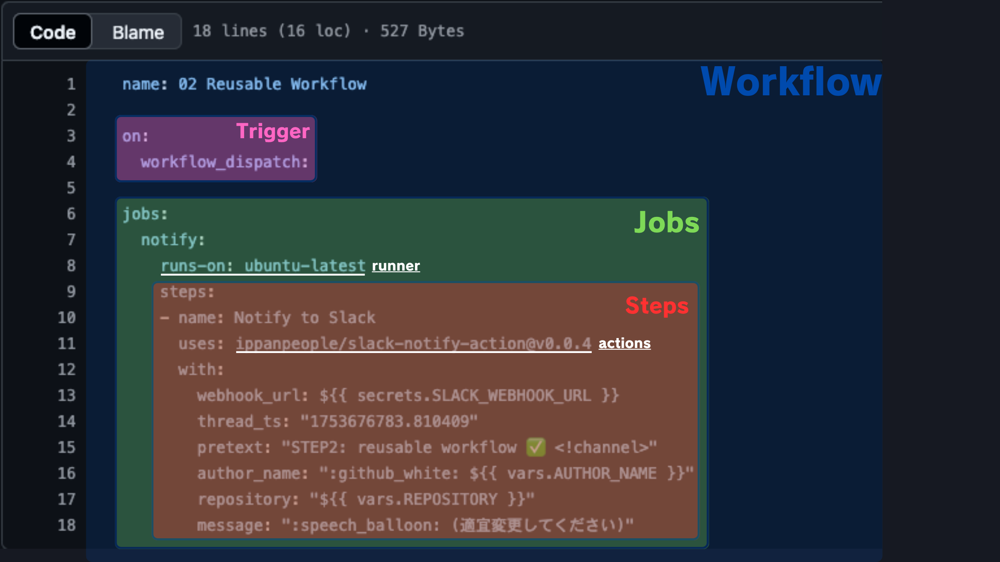
- **actions**
  - ワークフロー内で特定のタスクを実行する再利用可能なコード単位（プラグインのようなもの）

---

<!-- _class: pink lead -->

# GitHub Actions の初期設定

---

## GitHub Actions の有効化方法


1. **ワークフローが無効化されている状態を確認**
   - フォーク直後や新規リポジトリでは、GitHub Actions ワークフローが無効化されている場合があります。
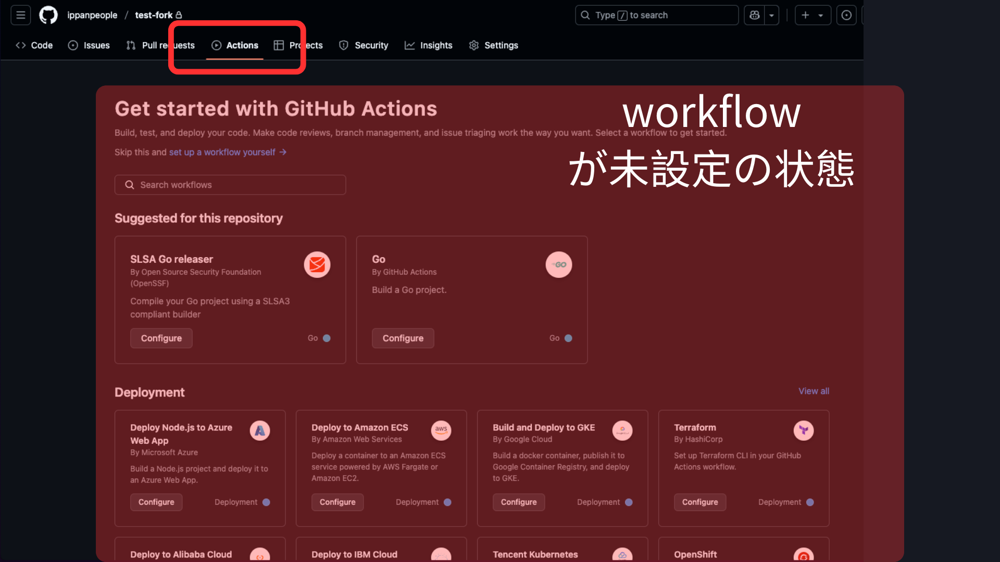

---

## GitHub Actions の有効化方法

2. **なぜワークフローが無効化されているのか確認**
    - GitHub Actions は、リポジトリの設定でワークフローのパーミッションが適切に設定されていない場合に無効化されます。
    - GitHub Actions は、.github/workflow ディレクトリ内にワークフロー定義ファイルが存在しない場合、またはワークフローのパーミッションが適切に設定されていない場合に無効化されます。

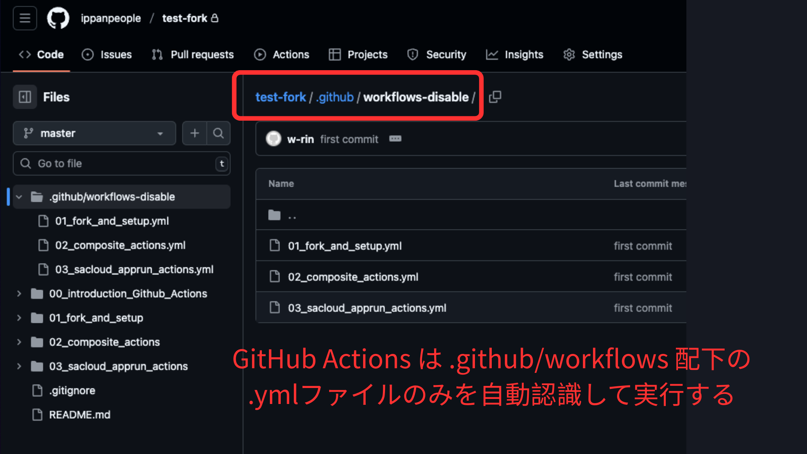

---

## GitHub Actions の有効化方法

3. **ワークフローを有効化する方法**
    - Settings > Actions > General に移動し Actions permissions を「Allow all actions and reusable workflows」に設定します。
    - 既存の .github/workflows-disable を正しくリネームして .github/workflows にします。

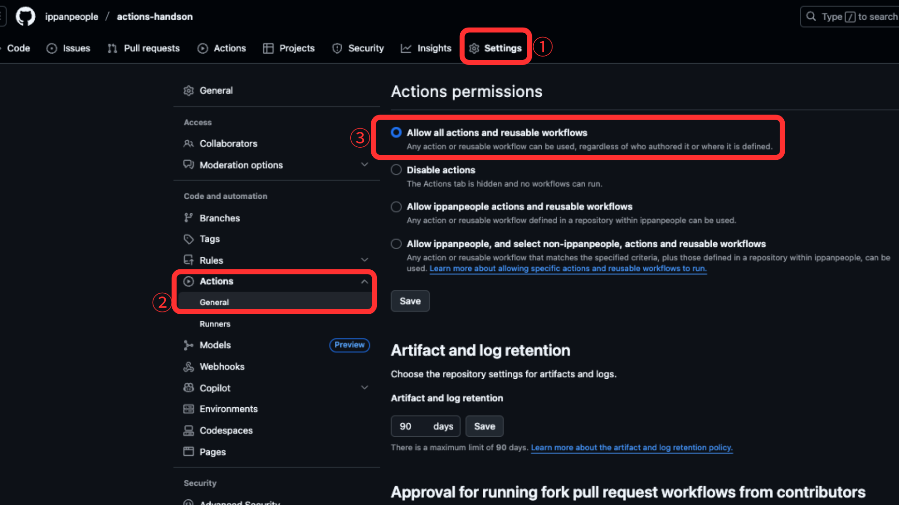
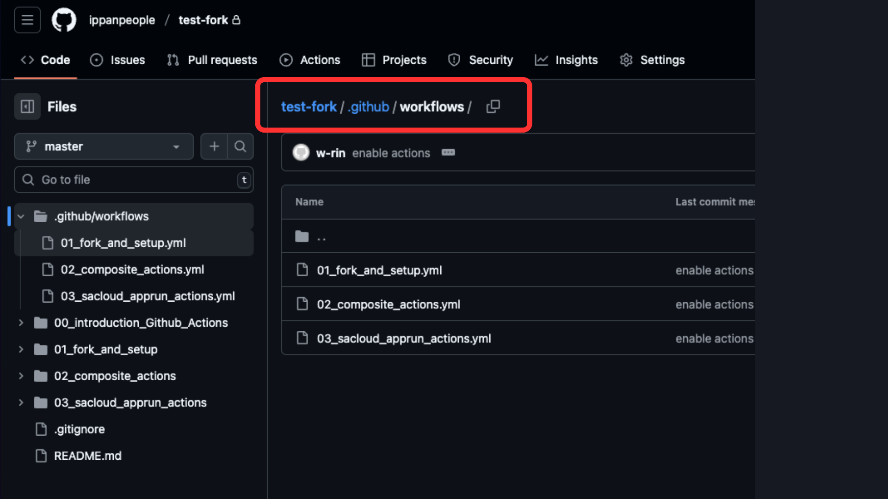

---

## GitHub Actions の有効化方法

4. **有効化後の状態を確認**
   - 有効化が完了すると、ワークフローが実行可能な状態になります。

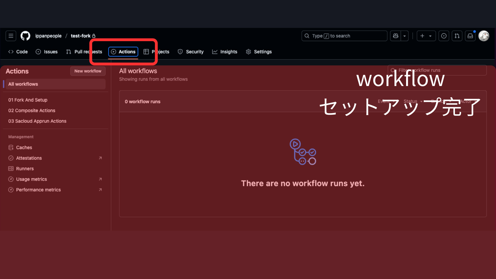

---

## GitHub Actions のシークレットと変数の設定方法

GitHub Actions では、外部サービスへの認証情報や個人情報などを安全に管理するために「シークレット（Secrets）」と「変数（Variables）」を利用します。シークレットは主にパスワードや API キーなどの機密情報を、変数はワークフロー内で再利用したい値（例：自分の名前やリポジトリリンクなど）を格納します。これらはリポジトリの Settings > Secrets and variables から設定できます。

---
## GitHub Actions のシークレットと変数の設定方法

1. **シークレットの設定**: Slack の Incoming Webhook URL など、外部サービス連携に必要な情報を登録します。
   - 例: Slack の Incoming Webhook URL
   ````
   SLACK_WEBHOOK_URL
   ````
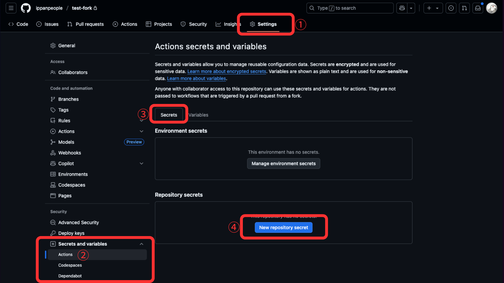
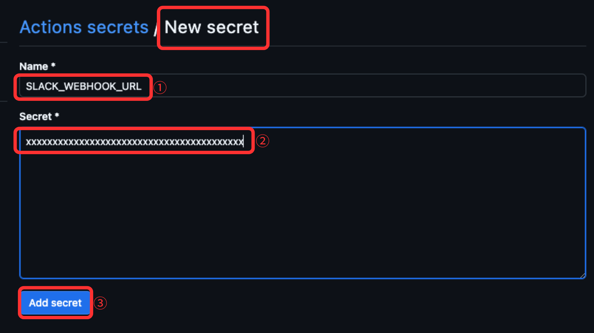

---

## GitHub Actions のシークレットと変数の設定方法

2. **変数の設定**: ワークフロー内で使う名前やリポジトリリンクなどを登録します。
   - 例: 自分の名前
   ````
   AUTHOR_NAME
   ````
   - 例: 自分の GitHub リポジトリリンク
   ````
   REPOSITORY
   ````
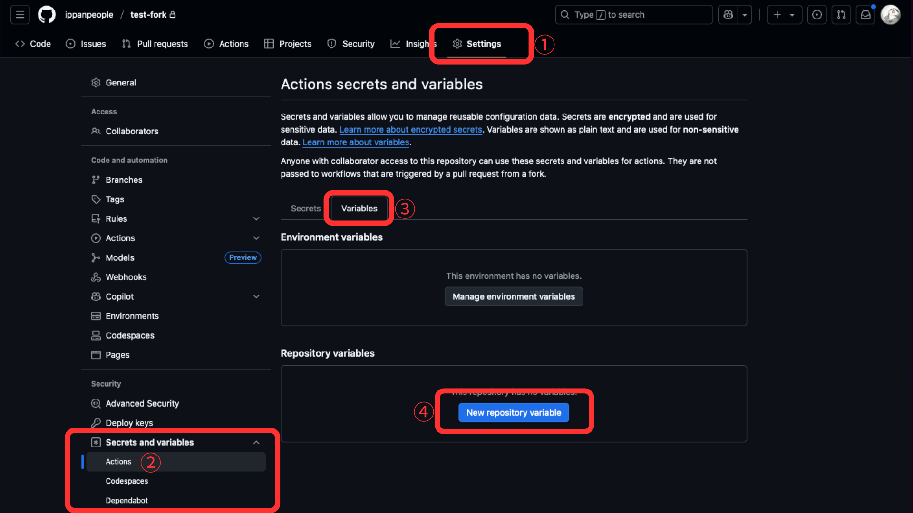
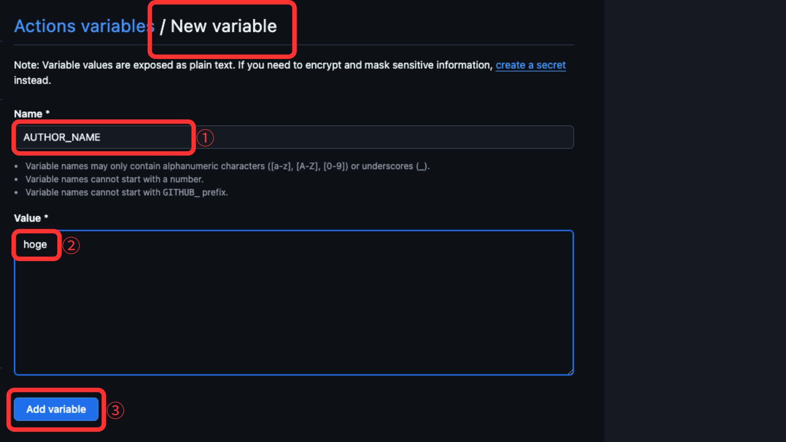

---

## GitHub Actions のシークレットと変数の設定方法
3. **設定後の確認**: 設定が正しく反映されているか確認します。
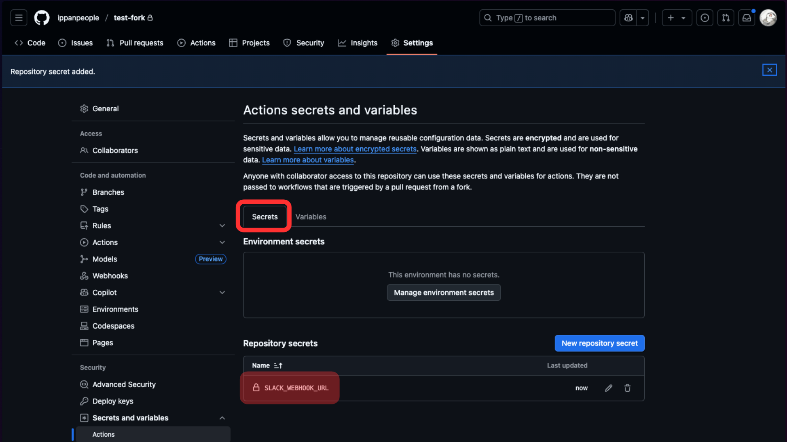
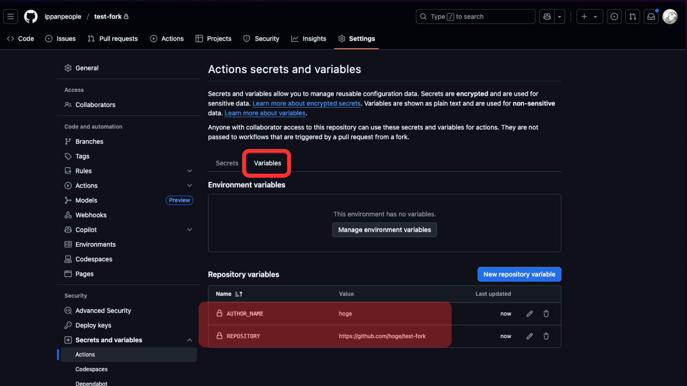

---

## GitHub Actions ワークフローの実行方法

1. **ワークフローの選択**: リポジトリの Actions タブに移動し、対象のワークフローを選択します。
2. **ワークフローの実行**: 「Run workflow」ボタンをクリックします。
3. **実行の確認**: ワークフローが正常に実行されると、Slack チャンネルにメッセージが送信されます。これにより、GitHub Actions のセットアップが正しく行われたことを確認できます。

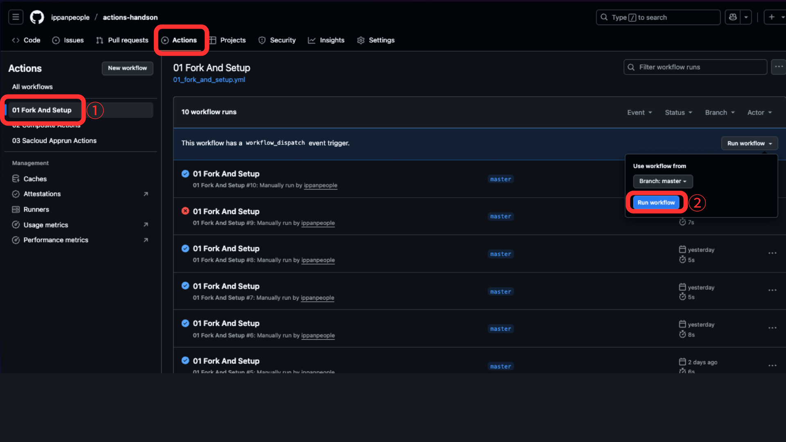

---

<!-- _class: pink lead -->
# Composite Actions の運用

---

## Composite Actions とは？
Composite Actions は、複数のシェルステップを組み合わせて作成されるカスタムアクションです。YAML で記述され、GitHub Actions のワークフロー内で再利用可能なロジックを提供します。これにより、複雑な処理を簡潔にまとめ、再利用性を高めることができます。

---

## 前のステップとの比較
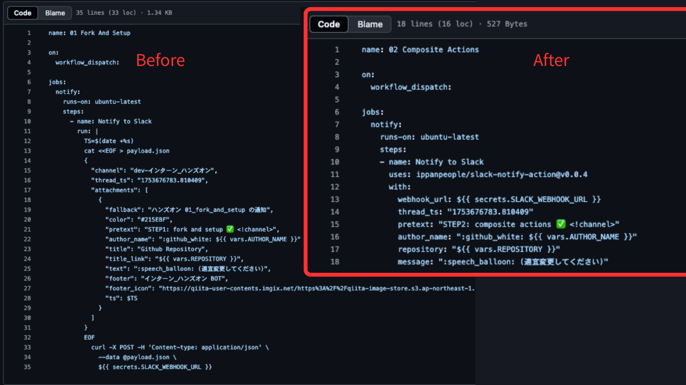

---

<!-- _class: pink lead -->
# sacloud_apprun_actions を使った AppRun デプロイ

---

## sacloud_apprun_actions とは？
`sacloud_apprun_actions` は、Go アプリケーションをさくらの AppRun サービスにデプロイするときのワークフローを簡潔にするための Composite Actionsです。**アプリケーションのビルド、コンテナレジストリへのプッシュ、AppRun へのデプロイを自動化します**。また、**データ永続化のためのオブジェクトストレージバケットの作成**機能も含まれており、アプリケーションの再起動や再デプロイ後もデータの永続化ができます。

---

## sacloud_apprun_actions の使い方
1. **ワークフロー例**: `sacloud_apprun_actions` ワークフローが含まれるリポジトリをフォークし、アプリケーションに合わせてワークフローファイルをカスタマイズします。

---

## sacloud_apprun_actions の使い方
````yaml
      - name: Goアプリをデプロイ
        id: deploy
        uses: ippanpeople/sacloud-apprun-action@v0.0.4
        with:
          use-repository-dockerfile: false
          app-dir: ./03_sacloud_apprun_actions
          sakura-api-key: ${{ secrets.SAKURA_API_KEY }}
          sakura-api-secret: ${{ secrets.SAKURA_API_SECRET }}
          container-registry: ${{ secrets.REGISTRY }}
          container-registry-user: ${{ secrets.REGISTRY_USER }}
          container-registry-password: ${{ secrets.REGISTRY_PASSWORD }}
          port: '8080'
          # SQLite + Litestream を使う場合は以下も指定
          object-storage-bucket: w-rin-test
          object-storage-access-key: ${{ secrets.STORAGE_ACCESS_KEY }}
          object-storage-secret-key: ${{ secrets.STORAGE_SECRET_KEY }}
          sqlite-db-path: ./data/app.db
          litestream-replicate-interval: 10s
````

---

## sacloud_apprun_actions の使い方
2. **Secrets と Variables の設定**: リポジトリの設定で必要な GitHub Actions シークレットと変数を作成します。
   - コンテナレジストリの URL:
````
REGISTRY
````
   - コンテナレジストリのユーザー名:
````
REGISTRY_USER
````
   - コンテナレジストリのパスワード:
````
REGISTRY_PASSWORD
````

---

## sacloud_apprun_actions の使い方

   - さくらの API キー:
````
SAKURA_API_KEY
````
   - さくらの API シークレット:
````
SAKURA_API_SECRET
````
   - オブジェクトストレージのバケット名:
````
STORAGE_BUCKET_NAME
````
---

## sacloud_apprun_actions の使い方

   - オブジェクトストレージのアクセスキー:
````
STORAGE_ACCESS_KEY
````
   - オブジェクトストレージのシークレットキー:
````
STORAGE_SECRET_KEY
````

---

## sacloud_apprun_actions の使い方

3. **ワークフローの実行**: ワークフローを手動でトリガーするか、特定のイベント（例: push, pull request）で自動実行します。

---

## データ永続化の実践方法

AppRun はステートレスなため、デプロイのたびにアプリケーションが再起動されます。sacloud_apprun_actions はデータ永続化の課題を解決するため、SQLite と Litestream を利用し、アプリ再起動後もデータが保持されるようにします。

---
## データ永続化の実践方法
> [!WARNING]
> 注意: SQLite と Litestream を利用する際は、システム設計の妥当性に注意してください。SQLite は小規模用途に適していますが、高負荷や大量データではパフォーマンス上の制約があります。特に、**TPS (Transactions Per Second)** や、**QPS (Queries Per Second)**、などの観点で制約が発生しやすいです。Litestream も設定や運用方法によってはデータの安全性・一貫性 (**Consistency**) に注意が必要です。システム要件に応じて、適切なデータベースやストレージ方式の選定を検討してください。
---
<!-- _class: pink lead -->

# 以上で GitHub Actions 説明は終了です
